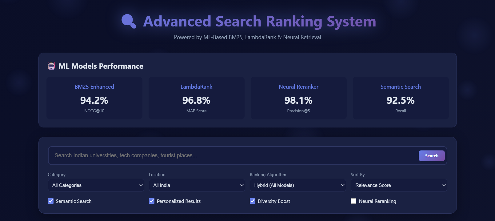
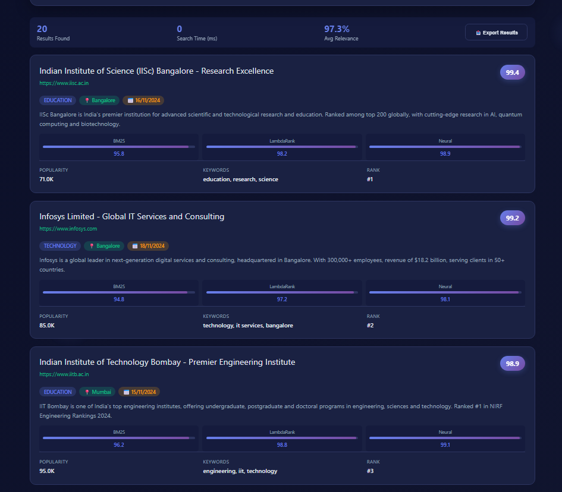

# Large-Scale Search Ranking & Retrieval System

## Overview
This web application is a sophisticated Large-Scale Search Ranking & Retrieval System. It incorporates multiple ML-driven ranking algorithms such as BM25, LambdaRank, and a Neural Reranker to provide highly relevant and personalized search results.

---

---

## Features
- Multi-model ranking: BM25, LambdaRank, Neural reranker, Semantic search, Hybrid algorithm
- Indian-specific mock data covering education, technology, tourism, healthcare, and business sectors
- Real-time search with filters (category, location, algorithm, sort order)
- Interactive visual scoring and relevance badges
- Export search results as JSON
